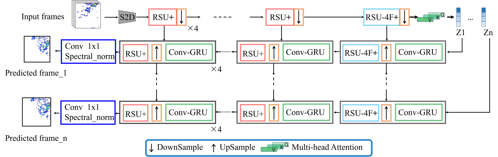

# TU$^2$Net a temporal precipitation noewcasting with multiple decoding modules


<p align="center">
  
</p>


This is a PyTorch implementation of the TU$^2$Net


# HOW to use ?
``` bash
python Tu2net/smaple.py --example.npydd2
```


